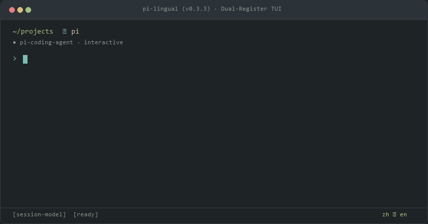

# pi-lingual

A bilingual terminal HUD and prompt transformer for Pi Coding Agent.

Code in your native language. See real-time Silicon Valley spoken phrasing and formal technical prose—or transform prompts into clean technical English to keep your code, comments, and commits consistent.

[](https://www.npmjs.com/package/pi-lingual)
[](LICENSE)
[](https://github.com/earendil-works/pi-coding-agent)
[-brightgreen)](tests/engine.test.ts)
[](tsconfig.json)

**English** | [简体中文](./README_zh.md)

<p align="center">
  
</p>

```text
  · [Original] 这个方案有点过度设计了，不如直接用标准库实现
  ┌ [Spoken]   This feels a bit over-engineered; we'd be much better off sticking with the standard library.
  │            (感觉有点过度设计了，用标准库划算得多)
  ├ [Written]  The proposed approach introduces unnecessary complexity. Leveraging native standard library implementations is preferred.
  │            (该方案引入了不必要的复杂度，建议优先采用原生标准库实现)
  └ [Vocab]    over-engineered (过度工程化) · be better off (更合适) · stick with (沿用) · leverage (利用)
```

## Quick Start

Install directly inside Pi Coding Agent:

```bash
pi install npm:pi-lingual
```

Works out of the box with your current session model credentials. No extra API keys or setup required.

---

## Core Value: Why Do Developers Need This?

Pairing with terminal AI coding agents creates four acute frictions for developers:

### 1. Global & Team Repositories Require Clean English
In open-source projects or cross-border teams, code comments, commit messages, and PR descriptions must be strictly in English.
When you prompt an AI agent in your native language, the model frequently generates code with native-language comments and explanations. You have to manually review and clean them up before every push.
In `english` mode: You type naturally in your native language. `pi-lingual` automatically rewrites your instruction into standard technical English before passing it to the AI. **All generated code, comments, and documentation remain uniformly in clean English.**

### 2. Catching the 5-Second Generation Gap
After hitting Enter, an LLM typically takes 5 to 15 seconds to synthesize code or execute refactorings.
That window is too short to switch to a browser, yet long enough for your focus to drift into idle staring.
`pi-lingual` creates a low-cognitive-load window right above your prompt. During that brief generation gap, glance at how the same thought maps between daily engineering chat (Slack / standups) and formal documentation (RFCs / PRs), cultivating authentic fluency effortlessly.

### 3. Zero Context Pollution & Zero Token Waste
Standard translation tools append English translations directly onto your prompt.
Across multi-turn conversations, this clutters chat history with redundant text, burning token budgets and diluting the model's reasoning focus.
`pi-lingual` operates as an ambient TUI sidecar overlay. **Your prompts to the AI remain completely clean; no translation tokens are injected into your conversation history.**

### 4. Rock-Solid Terminal Layout (No More Border Tears)
East Asian full-width (CJK) characters occupy 2 visual columns.
Traditional closed rectangular boxes (`│ ... │`) fracture when character widths are miscalculated, causing ghost lines, wrapping tears, and cursor desync.
`pi-lingual` discards closed borders entirely, using an open left-rail tree branch (`· ┌ ├ └`) built on Unicode UAX #11 metrics. It stays visually solid even on narrow split panes.

---

## Three Operating Modes

Toggle modes anytime with `/2` or `/lingual`:

```text
  /2 (cycles: original ➔ english ➔ off ➔ original)
```

| Mode | What You Type | What the AI Receives | What You See | Best For |
| :--- | :--- | :--- | :--- | :--- |
| **`original`** *(Default)* | Native Language *(e.g. Chinese / Japanese)* | **Raw Native Prompt**<br>*(0ms pass-through, 0 context pollution)* | Interactive dual-register HUD *(Spoken + Written + Vocab)* | Solo coding while absorbing authentic engineering phrasing |
| **`english`** *(Transform)* | Native Language *(e.g. Chinese / Japanese)* | **Standard Technical English**<br>*(Rewrites prompts into RFC-grade English)* | Companion card previewing the generated English | Team/open-source repos requiring English comments and commits |
| **`off`** | Any Text | **Raw Text** *(0 background calls, 0 widgets)* | Hidden / disabled | Pure coding sessions with zero UI overlays |

### Hybrid Intent Grafting (Code Stays Untouched)
In `english` mode, pasting code blocks or error logs never translates the code:
- **Translates intent only**: Converts natural language instructions into crisp technical English.
- **Keeps code untouched**: Grafts your original code block or stack trace right back onto the prompt.
- **The result**: Clean English instructions paired with complete technical context.

---

## In Action: Dual-Register Philosophy

Memorizing isolated vocabulary lists does not build expressive capability. Real software engineering naturally divides into two distinct registers:

```text
  · [Original] 这个方案有点过度设计了，不如直接用标准库实现
  ┌ [Spoken]   This feels a bit over-engineered; we'd be much better off sticking with the standard library.
  │            (感觉有点过度设计了，用标准库划算得多)
  ├ [Written]  The proposed approach introduces unnecessary complexity. Leveraging native standard library implementations is preferred.
  │            (该方案引入了不必要的复杂度，建议优先采用原生标准库实现)
  └ [Vocab]    over-engineered (过度工程化) · be better off (更合适) · stick with (沿用) · leverage (利用)
```

* **`[Spoken] (Conversational Register)`**: High-frequency phrasing used by Silicon Valley engineering teams. Includes daily standups, Slack huddles, pair-programming chats, and common phrasal verbs.
* **`[Written] (Architecture Register)`**: Formal technical prose. Built for RFC proposals, pull request descriptions, architecture reviews, and issue trackers.
* **`[Vocab] (Collocations)`**: Extracted engineering collocations. Automatically highlighted with non-destructive ANSI underline formatting when matched in sentences.

---

## Dynamic Dual-Slot Architecture (Domain-Specific Customization)

`[Spoken]` and `[Written]` are simply the out-of-the-box defaults for **Slot 1** and **Slot 2** in `pi-lingual`'s underlying **Dynamic Dual-Slot Architecture**. The engine is not restricted to software engineering; both slots can be decoupled and rebound to match any domain via custom Agent instructions or preset configurations:

| Preset | Target Domain | Slot 1 (Casual / Immediate) | Slot 2 (Formal / Rigorous) |
| :--- | :--- | :--- | :--- |
| **`developer` (Default)** | Software Engineering | `[Spoken]` Silicon Valley Standup / Slack | `[Written]` RFC / PR Review Plain English |
| **`social`** | Twitter/X & Social Growth | `[Hook]` Viral Hook / Engaging Banter | `[Deep]` Structured Technical Insight |
| **`japanese`** | Japanese Immersion | `[口語]` Casual Tameguchi / Huddle | `[敬語]` Business Polite Keigo |
| **`academic`** | Academic Research | `[Discussion]` Lab Colloquy / Q&A | `[Paper]` Peer-Reviewed Journal Prose |

*To customize slot styles, describe your target audience and tone to your Agent (e.g. `/lingual-agent`), or supply custom slot definitions via `CustomSlotsConfig` in the API.*

---

## Form Factors: Full Tree vs. Single-Line Capsule

Two layouts designed to protect your editor workspace:

<p align="center">
  
</p>

1. **Left-Rail Tree HUD (Default)**: Open-branch layout (`· ┌ ├ └`) using Unicode UAX #11 metrics. Eliminates closed borders to prevent terminal wrapping tears. Stays strictly within 9 lines to avoid host widget truncation warnings.
2. **Single-Line Capsule Mode (`/compact`)**: Compresses the HUD into a dense single-line stream:
   ```text
   zh ⇄ en · [Spk] This feels over-engineered... │ [Wrt] Proposed approach introduces unnecessary complexity...
   ```
   *Saves over 80% vertical space in tight split panes (tmux, WezTerm). Activates automatically when terminal height is $< 22$ lines.*

---

## Real-World Multilingual Matrix

Translating into English is the primary focus, but major languages are supported bidirectionally:

<p align="center">
  
</p>

| Source | Scenario | Input Prompt | [Spoken] Daily Standup / Slack | [Written] RFC / PR Review |
| :--- | :--- | :--- | :--- | :--- |
| **🇨🇳 zh** | Architecture | `这个方案过度设计了，不如直接用标准库` | `This feels a bit over-engineered; let's stick with the standard library.` | `The proposed approach introduces unnecessary complexity. Leveraging native standard library implementations is preferred.` |
| **🇯🇵 ja** | Systems | `メモリリークの可能性があるので、クリーンアップ処理を追加してください` | `There might be a memory leak here, so let's make sure we toss in some cleanup logic.` | `To prevent potential memory leaks, please incorporate explicit cleanup and resource disposal routines.` |
| **🇪🇸 es** | Code Review | `El PR es demasiado grande, sugiero dividirlo en dos cambios atómicos` | `This PR is huge — how about we split it into a couple of bite-sized PRs instead?` | `The PR scope is excessively broad; decomposing it into two discrete, atomic commits is advised.` |
| **🇩🇪 de** | Distributed | `Wir müssen sicherstellen, dass diese Schnittstelle idempotent ist` | `We've gotta make sure this endpoint is strictly idempotent so duplicate requests don't bite us.` | `It is imperative to guarantee strict idempotency for this API endpoint to prevent duplicate mutations.` |

Switch language pairs anytime:
```bash
/lang ja en      # Japanese to English
/lang es en      # Spanish to English
/lang de en      # German to English
/lang en ja      # English to Japanese
/lang zh ja      # Chinese to Japanese
/lang 日语       # Natural language aliases supported
```

**Primary Language Sovereignty**: Switching languages updates status badges, command hints, and UI chrome with zero hardcoded residues.

---

## Engineering Highlights

- 🛡️ **Zero Context Pollution**: Runs as an ambient TUI sidecar. Never injects translation tokens into your LLM chat history.
- ⚡ **Instant & Non-Blocking**: Press Enter to clear cards immediately. Stale background requests abort on the fly via `AbortController`.
- 📐 **Rock-Solid Terminal Layout**: Open tree branches (`· ┌ ├ └`) using Unicode UAX #11 metrics. Never breaks borders or wraps awkwardly on wide characters.
- ⚡ **Command Pass-Through Shield**: 40+ common CLI prefixes (`git`, `docker`, `npm`, `cargo`) and code blocks bypass translation with zero token spend.
- 🧠 **In-Memory LRU Cache**: Frequent affirmations (`继续`, `认同`, `开始吧`) return instantly at 0ms from a 50-entry cache.
- 🧹 **Noise Filtering**: Automatically strips clipboard screenshot paths (`pi-clipboard-*.png`) and folds compiler logs before translation.
- 🪶 **Model Isolation**: Runs on your session model by default, or pick a lightweight model to protect high-tier reasoning quota.

---

## Commands & Shortcuts

| Command | Alias | Description |
| :--- | :--- | :--- |
| `/2 [sub]` | `/lingual [sub]` | Master command: cycle modes, or route subcommands |
| `/slots [cmd]` | `/2-slots` | Dynamic slot pipeline: add custom slots or remove source text row |
| `/compact` | `/2-compact` | Toggle between Tree HUD and Capsule mode |
| `/lang <source> [target]` | `/2-lang` | Switch language pair (e.g. `/lang ja en`, `/lang 日语`) |
| `/last` | `/2-last` | Replay the most recent companion card |
| `/2-model <id>` | `/lingual-model` | Switch companion model (`auto` to follow session, or specify a model ID) |
| `/status` | `/2-status` | Display diagnostics, active model, and cache stats |

*Keyboard shortcuts: `Alt+.` (next page), `Alt+,` (previous page). Standalone CLI: `lingual "prompt"`.*

---

## Universal Dynamic Slot Pipeline (Fully Movable Slots)

Never get locked into rigid, hardcoded templates. Every slot on your companion card—including the source text—is a decoupled building block:

- **Hide original source text**:  
  Run `/slots rm source` to completely remove the source text row. Cards will display clean translation branches directly.
- **Add custom tone & style slots**:  
  Run `/slots add twitter Tweet Short punchy tweet under 280 chars`. The LLM JSON schema and Tree HUD layout adapt dynamically in real-time.
- **Toggle or reset slots**:  
  Run `/slots toggle <id>` to temporarily mute a slot; run `/slots reset` to restore default initial slots anytime.

> 💡 **Agent Confirmation Protocol**: When asking your Agent to configure companion slots, your Agent will proactively confirm two things: **your desired slot count**, and **the specific style and role for each slot (including whether you want to keep or suppress the original text)**.

---

## Dedicated Models & Privacy

### Protecting High-Tier Reasoning Quotas
By default, `pi-lingual` runs securely in-process using your active Pi session model.

When pairing with high-tier reasoning models, delegate companion duties to a lightweight model to save quota:
```bash
/2-model <lightweight-model-id>    # Delegate to a lightweight model
/2-model auto                      # Revert to follow-session mode
```

Local Ollama or custom OpenAI-compatible endpoints can also be configured in `~/.pi/agent/lingual.json`:
```json
{
  "endpoint": "http://127.0.0.1:11434/v1/chat/completions",
  "model": "qwen2.5:3b"
}
```

> 🔒 **Absolute Privacy Guarantee**: `pi-lingual` has **zero external dependencies** (`dependencies: {}`), zero telemetry, and zero tracking. Requests go only to your authenticated model endpoints.

---

## License

MIT © [Jason Song](https://github.com/3ZEROS12)
