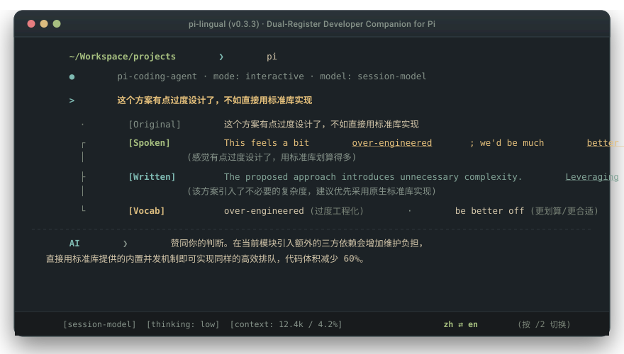
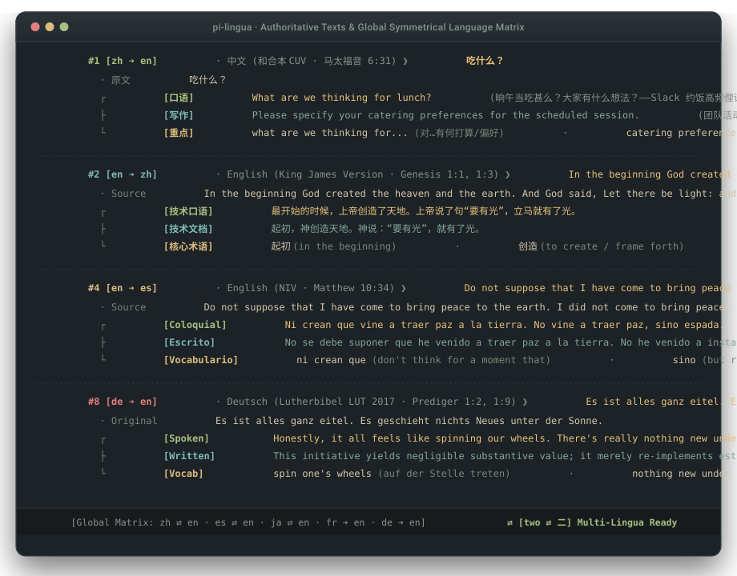

# @3zeros12/pi-lingua

> **专为 Pi Coding Agent 打造的零侵扰开发者翻译与双语域沉浸伴学插件**  
> 在终端内用母语自然敲击提示词，输入框上方即时浮现北美硅谷敏捷口语与严谨工程技术写作，兼顾代码编写心流与日常语感积累。

[](https://www.npmjs.com/package/@3zeros12/pi-lingua)
[](LICENSE)
[](https://github.com/earendil-works/pi-coding-agent)
[](tests/engine.test.ts)

[English](./README.md) | **简体中文**

<p align="center">
  
</p>

---

## 现实工程摩擦

开发者每天在终端向 Coding Agent 输入上百条提示词。现有的翻译工具往往带来以下妥协：

* **机械字面直译**：遇到生活与工程口语时语义失真。询问午饭安排时，通用翻译通常给出干瘪的 `What to eat?`；而北美工程团队在 Slack 里的真实约饭表达是：`What are we feeling for lunch?`。
* **后台静默翻译**：为了所谓“无感”，插件在后台悄悄将输入转成英文发给大模型。大模型收到了英文，开发者屏幕上却空空如也，白白浪费了高频接触地道表达的机会。
* **侵入式气泡拼接**：部分插件直接把英文译文追加到用户发言下方，不仅干扰阅读，更让会话历史充斥着冗余文本，轮轮消耗宝贵的上下文窗口。

`pi-lingua` 在终端输入框上方挂载一个独立的悬浮视窗，实时呈现日常口语俚语与规范技术书面双重语域，且绝不污染大模型的会话历史记录。

---

## 核心架构与物理机制

```text
  · 原文   吃什么？
  ┌ [口语] What are we feeling for lunch? (中午整点啥好吃的？)
  ├ [写作] Please specify your catering preferences for the upcoming session. (请明确下阶段会议的用餐偏好。)
  └ [重点] feel like (想要/倾向于) · specify (明确列出) · catering preferences (餐饮偏好)
```

### 1. 左导轨极简树状视窗（Trifecta Left-Rail Tree Branch）
在 Windows Terminal、Alacritty 与 iTerm2 中，中日韩（CJK）全角字符极易打破闭合矩形边框的宽度计算，产生严重的断行与重影。`pi-lingua` 彻底剔除了右侧与底部的闭合边框，改用开放式左导轨树状分支：
* ` · 原文`：完整保留当前输入的原始文本，提供清晰的认知锚点。
* ` ┌ [口语]`：北美硅谷敏捷团队的真实口语表达（站会沟通、Slack 交流、结对编程、缩写与常用短语动词），末尾附带母语真实语感。
* ` ├ [写作]`：符合现代规范的技术书面表达（RFC 草案、PR 描述、Issue 讨论、架构评审），末尾附带严谨技术语感。
* ` └ [重点]`：自适应提取的盲区短语与工程搭配，单行串联呈现。

### 2. 会话与上下文绝对纯净隔离（Zero Context Pollution）
插件利用 Pi 的扩展拦截机制，确保本地存储与模型会话历史不受任何多余文本干扰：
* **原文模式（`original`，默认）**：用户敲击回车后，原始输入以 0ms 延迟直接放行交由大模型处理，翻译任务在后台异步执行。落盘的会话记录中仅保留纯净母语，绝不在上下文内拼接英文译文。
* **英文模式（`english`）**：插件等待翻译引擎返回后，仅提取其中的规范技术书面英文发送给大模型，括号内的母语释义物理剥离，驱动大模型以全英文上下文展开深度代码推理。
* **关闭模式（`off`）**：完全静默直通，跳过一切翻译逻辑。

### 3. 自适应词汇提取与单行紧凑流（Inline Stream）
死板固定“1~2个词”的规则，要么会遗漏关键短语，要么会提取过于简单的基础单词。`pi-lingua` 根据目标语言掌握水平动态评估：当输入内容涉及进阶开发者容易混淆的短语动词、介词固定搭配或架构术语时，引擎会自适应将其全部提取。

为了保护终端内珍贵的纵向可视面积，所有重点词汇均在单行内以 ` · ` 拼接：
```text
over-engineered (过度工程化) · be better off (采用……更为合适) · stick with (坚持沿用)
```
视窗严禁向下折行堆叠词典式解释，确保终端代码编辑区域不被挤压变形。

### 4. 饱和命令与 CLI 覆盖矩阵
切换模式或查询翻译均支持最小击键操作：
* **Pi 终端会话内**：输入 `/lingua`、`/lingual`、`/translate` 或单字符命令 `/2`，即可按 `原文 ➔ 英文 ➔ 关` 顺序循环切换。
* **状态栏实时指示**：终端底部状态栏常驻当前运行状态，如 `⇄ [二 ⇄ two] 原文`，切换时即时响应。
* **系统全局 CLI**：支持通过 `lingua`、`lingual`、`translate`、`lg`、`2` 等别名在任意 Shell 中快速查询：
  ```bash
  2 "这个方案有点过度设计了，不如直接用标准库实现"
  ```

---

## 终端实录体验

### 确认方案并推进
```text
> 认同，开始吧
```
```text
  · 原文   认同，开始吧
  ┌ [口语] Totally on board with that — let's dive right in. (完全赞同，咱们直接开搞)
  ├ [写作] Acknowledged. Let's proceed with the implementation. (确认赞同，着手推进具体实施)
  └ [重点] on board with (赞同/支持) · dive in (立刻着手)
```

### 讨论架构折衷
```text
> 这个方案有点过度设计了，不如直接用标准库实现
```
```text
  · 原文   这个方案有点过度设计了，不如直接用标准库实现
  ┌ [口语] This feels a bit over-engineered; we'd be much better off just sticking with the standard library. (感觉有点过度设计了，用标准库划算得多)
  ├ [写作] The proposed approach introduces unnecessary complexity. Leveraging native standard library implementations is preferred. (该方案引入了不必要的复杂度，建议优先采用原生标准库实现)
  └ [重点] over-engineered (过度工程化) · be better off (做某事更合适) · stick with (坚持使用) · leverage (利用/借助)
```

### 高频单步推进
```text
> 继续
```
```text
  · 原文   继续
  ┌ [口语] Let's keep going. (继续往下搞)
  ├ [写作] Proceed with the next steps. (推进后续步骤)
  └ [重点] keep going (继续推进) · proceed with (着手推进)
```

---

## 全球对称多语种实机展台

`pi-lingua` 支持跨语种对称运行。无论是国际开发者通过英文学习中文、日文、西班牙文，还是欧洲工程师在法德语境下协作，均可获得同等水准的口语与技术书面双模对照。

<p align="center">
  
</p>

### 8 组跨语种权威原典实测矩阵

| 语言流向 | 地区原典版本 (Source Tradition) | 输入文本 (Input) | 敏捷口语 [口语] | 技术书面 [写作] |
| :--- | :--- | :--- | :--- | :--- |
| **🇨🇳 zh ➔ 🇺🇸 en** | **中文 · 和合本 (CUV)**<br>*(马太福音 6:31 / 程序员日常)* | `吃什么？` | `What are we feeling for lunch?`<br>*(Slack 团队约饭地道俚语)* | `Please specify your catering preferences...`<br>*(正式会议餐饮登记)* |
| **🇺🇸 en ➔ 🇨🇳 zh** | **English · King James (KJV)**<br>*(创世记 1:1, 1:3)* | `In the beginning God created the heaven and the earth...` | `最开始的时候，上帝创造了天地。上帝说了句“要有光”，立马就有了光。` | `起初，神创造天地。神说：“要有光”，就有了光。`<br>*(规范技术译本)* |
| **🇪🇸 es ➔ 🇺🇸 en** | **Español · Reina-Valera (RVR 1960)**<br>*(约翰福音 3:16)* | `Porque de tal manera amó Dios al mundo...` | `God loved the world so much that He gave His one and only Son...` | `For God so loved the world that He gave His only begotten Son...` |
| **🇺🇸 en ➔ 🇪🇸 es** | **English · NIV**<br>*(马太福音 10:34)* | `Do not suppose that I have come to bring peace...` | `Ni crean que vine a traer paz a la tierra. No vine a traer paz, sino espada.` | `No se debe suponer que he venido a traer paz... No he venido a instaurar la paz...` |
| **🇯🇵 ja ➔ 🇺🇸 en** | **日本語 · 新共同訳**<br>*(马太福音 7:7)* | `求めなさい。そうすれば、与えられる...` | `Just ask, and you'll receive; look for it, and you'll find it...` | `Ask, and it will be given to you; seek, and you will find...` |
| **🇺🇸 en ➔ 🇯🇵 ja** | **English · ESV**<br>*(哥林多前书 13:4)* | `Love is patient and kind; love does not envy...` | `愛ってさ、辛抱強くて思いやりがあるんだよね。人を妬んだり自慢したりもしないし...` | `愛は忍耐強く、また情け深い。愛は嫉妬せず、誇ることもなく、驕り高ぶらない。` |
| **🇫🇷 fr ➔ 🇺🇸 en** | **Français · Louis Segond (LSG 1910)**<br>*(诗篇 23:4)* | `Quand je marche dans la vallée de l'ombre de la mort...` | `Even when I walk through the valley of the shadow of death...` | `Even though I walk through the valley of the shadow of death, I will fear no evil...` |
| **🇩🇪 de ➔ 🇺🇸 en** | **Deutsch · Lutherbibel (LUT 2017)**<br>*(传道书 1:2, 1:9)* | `Es ist alles ganz eitel. Es geschieht nichts Neues unter der Sonne.` | `Honestly, it all feels like spinning our wheels. There's really nothing new under the sun...` | `This initiative yields negligible substantive value; it merely re-implements established paradigms...` |

---

## AI-Native 自主定制协议

项目根目录的 `AGENTS.md` 固化了自主定制协议。调整语言对或优化学习风格时，无需手动查阅配置手册或修改 TypeScript 代码。

在 Pi、Cursor 或 Claude Code 中打开本项目时，直接以自然语言提出需求：
> *“我想把这个伴学插件定制为学习日文 / 专攻技术 RFC 风格。”*

智能体将全自动完成以下配置流程：

1. **四维母语访谈**：智能体使用你的母语主动发起访谈，确认输入母语与目标语言（A ➔ B）、当前能力基准与测试目标、垂直工程领域、语域侧重。
2. **母语 A 最高统治权**：切换为新语言对（如英文 ➔ 日文）时，智能体将插件的所有状态名称（`Original`、`English`、`Off`）、UI 标签与系统通知完整替换为母语 A 的地道表达，清除旧语种残留。
3. **自适应词汇提示词校准**：根据你的技术方向与能力基准，动态改写 `src/engine.ts` 中的 Few-shot 样例与词汇抽取策略。
4. **编译与物理校验**：自动运行 `npm test` 与 `npm run build`，完成类型校验与测试套件验证。

> **⚠️ Node.js ESM 进程级缓存关键警示**：  
> 由于 Node.js 运行时对 ESM 模块进行内存级常驻缓存，在当前终端中执行 `/reload` 无法卸载已加载的扩展。**完成定制与构建后，必须彻底退出终端并重新运行 `pi`，新编译的模块方可物理生效。**

---

## 安装与使用

### 安装为 Pi Coding Agent 插件
```bash
# 从本地仓库直接安装
pi install D:/Workspace/projects/pi-lingua

# 或从 npm 仓库安装
pi install npm:@3zeros12/pi-lingua
```

### 作为独立 CLI 运行
在终端中直接查询地道技术表达：
```bash
# 支持任意已注册命令别名：lingua、lingual、translate、lg、2
lingua "这几个接口需要做幂等性校验"
2 "内存占用过高，排查一下是否有未释放的句柄"
```

---

## ⚙️ 环境与模型网关配置 (Environment & Gateway)

`pi-lingua` 开箱即用支持任意兼容 OpenAI API 规范的本地或云端 LLM 网关：

| 环境变量 | 默认值 | 说明 |
| :--- | :--- | :--- |
| `LINGUA_ENDPOINT` | `http://127.0.0.1:8045/v1/chat/completions` | 兼容 OpenAI 格式的模型推理补全端点 |
| `LINGUA_API_KEY` | *(留空)* | 网关授权密钥（可留空或填入对应 API Key） |
| `LINGUA_MODEL` | `gemini-3.8-flash` | 伴学提取所使用的目标模型名称 |

在环境变量中配置后启动 `pi` 即可全局生效：
```bash
export LINGUA_ENDPOINT="https://api.openai.com/v1/chat/completions"
export LINGUA_API_KEY="sk-..."
export LINGUA_MODEL="gpt-4o-mini"
```

---

## 发行三部曲指引

### 1. 推送到 GitHub
```bash
git init
git add .
git commit -m "feat: release pi-lingua v0.1.0 with dual-register HUD & multilingual showcase"
git branch -M main
git remote add origin https://github.com/3ZEROS12/pi-lingua.git
git push -u origin main
```

### 2. 发布到 npm
```bash
npm run build
npm test
npm publish --access public
```

### 3. 挂载到 Pi 生态扩展库
```bash
# 个人全局安装验证
pi install npm:@3zeros12/pi-lingua
```
向官方 [pi-coding-agent](https://github.com/earendil-works/pi-coding-agent) 仓库提交 PR，在 `packages.md` 中登记 `@3zeros12/pi-lingua`。

---

## 开源协议

MIT © [Jason Song](https://github.com/3ZEROS12)
