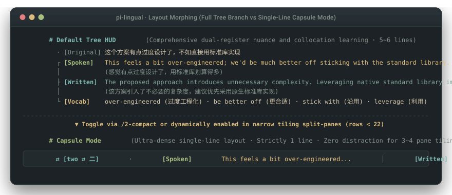

# pi-lingual

> **专为 Pi Coding Agent 打造的零侵扰开发者翻译与双语域沉浸伴学插件**  
> 在终端内用母语自然敲击提示词，输入框上方即时浮现北美硅谷敏捷口语与严谨工程技术写作，兼顾代码编写心流与日常语感积累。

[](https://www.npmjs.com/package/pi-lingual)
[](LICENSE)
[](https://github.com/earendil-works/pi-coding-agent)
[-brightgreen)](tests/engine.test.ts)
[](tsconfig.json)

[English](./README.md) | **简体中文**

<p align="center">
  
</p>

---

## 现实工程摩擦

在借助终端 AI Coding Agent（Pi、Claude Code、Cursor CLI）进行日常结对开发时，非英语母语开发者常面临以下技术阻碍：

1. **机械字面直译**：通用翻译工具脱离软件工程真实协作语境。询问午饭安排时，字面直译给出生硬的 `What to eat?`，而北美工程团队在 Slack 里的真实表达是 `What are we feeling for lunch?`。
2. **终端 CJK 几何撕裂**：东亚字符（CJK）在终端中占据 2 个显示列宽。使用闭合边框（`│ ... │`）包裹多语言文本时，字符宽度测算偏差会导致整行断裂重影，在 Windows Terminal、Alacritty 与 iTerm2 中频发排版错位。
3. **会话历史 Token 污染**：将英文译文直接拼接在提示词中发送给模型，导致后续每一轮对话都重复携带冗余的翻译文本，消耗上下文窗口并分散模型的推理注意力。
4. **异步竞态与 Token 偷跑**：连续敲击回车时，前一轮慢速网络请求未完成，返回的数据会直接覆写新卡片；无头请求在后台持续流式接收，浪费数百个推理 Token。
5. **异常堆栈与诊断信息冲垮上下文**：粘贴大段终端报错、编译器诊断或剪贴板截图路径时，未经脱敏的文本直接撑爆模型调用预算，导致界面杂乱。

`pi-lingual` 在终端输入框上方挂载确定性的悬浮视窗，实时呈现日常口语俚语与规范技术书面双重语域，且不向会话历史写入额外文本。

---

## 核心架构与物理机制

```text
  · [Original] 这个方案有点过度设计了，不如直接用标准库实现
  ┌ [Spoken]   This feels a bit over-engineered; we'd be much better off sticking with the standard library.
  │            (感觉有点过度设计了，用标准库划算得多)
  ├ [Written]  The proposed approach introduces unnecessary complexity. Leveraging native standard library implementations is preferred.
  │            (该方案引入了不必要的复杂度，建议优先采用原生标准库实现)
  └ [Vocab]    over-engineered (过度工程化) · be better off (更合适) · stick with (沿用) · leverage (利用)
```

### 1. 左导轨极简树状视窗（Trifecta Left-Rail Tree Branch）
变宽 Unicode 字符极易打破矩形闭合边框。`pi-lingual` 舍弃了右侧与底部的闭合边框，改用开放式**左导轨树状分支**（`· ┌ ├ └`）：
* **`  · [Original]`**：保留当前输入的原始文本，超长时采用悬挂缩进自然折行，在第 11 列与后续分支严格对齐。
* **`  ┌ [Spoken]`**：北美硅谷团队的敏捷口语表达（站会沟通、Slack 交流、结对编程、缩写与短语动词），末尾附带母语意向语感。
* **`  ├ [Written]`**：符合技术规范的书面表达（RFC 草案、PR 描述、Issue 讨论、架构评审），末尾附带严谨技术语感。
* **`  └ [Vocab]`**：提取的关键短语与工程搭配，单行串联呈现。

### 2. Unicode UAX #11 物理盒模型与排版预算守卫
宿主终端对悬浮小部件施加了严格的行数限制（Pi 核心会对超过 10 行的小部件执行硬截断并报错）。`pi-lingual` 实现了确定性盒模型排版引擎（`src/layout.ts`）：
* **UAX #11 视觉列宽测算**：精确计算 CJK 宽字符（2 列）、半角 ASCII（1 列）与零宽 ANSI 控制转义序列（0 列）。
* **标点行头禁则（Kinsoku Shori）**：严格禁止标点符号（如 `，`、`。`、`！`、`？`、`）`、`]`、`»`）出现在折行行首。
* **4 级硬预算守卫（Strict $\le 9$ Lines）**：分级降阶算法在数学上保证 HUD 输出严格 $\le 9$ 行，杜绝宿主截断报错。
* **目标语完整性铁律（Target Language Integrity Invariant）**：视窗空间紧凑时，优先保障口语和写作英文主句（`spoken` 与 `written`）完整展示，母语解释优先内联至括号中，绝不在句子中间拦腰斩断。
* **重点词汇原子短语截断守卫**：以 `·` 分隔的短语为最小原子单元进行排版。若空间不足，整项截断并以 `· ...` 收尾，杜绝出现 `compression (压缩 ...` 式残缺未闭合括号。
* **动态语言密度感知浓缩触发器**：CJK 表意文字的信息密度为西文的 2.5 倍。中日韩输入 $\ge 45$ 字符或包含 $\ge 2$ 个分句时，大模型主动输出精炼表达与 `summary` 大标题，消除长句直译导致的行数膨胀。

### 3. 微光短语高亮（Spotlight Highlighting）
语感吸收需要即时的视觉焦点。`pi-lingual` 动态提取重点短语并在双语域句子中进行模式匹配，施加非破坏性 ANSI 下划线（`\x1b[4m...\x1b[24m`）。它在保留字符大小写和列宽指标的前提下，引导视线在 100 毫秒内锁定核心动词与介词搭配。

### 4. 极端分屏单行胶囊模式（Compact Capsule Mode）
在 tmux、WezTerm 多窗格平铺（3~4 分屏）或窗口高度不足（行数 `< 22`）的环境中，纵向空间十分有限。

<p align="center">
  
</p>

键入 `/compact` 或 `/2-compact` 即可一键折叠为**单行胶囊模式**：
```text
zh ⇄ en · [Spoken] This feels over-engineered... │ [Written] Proposed approach introduces unnecessary complexity...
```
节省 80% 以上纵向空间，保护核心代码编辑视野。

### 5. 报错审查与意图萃取管道（`src/sanitizer.ts`）
日常提示词常夹杂报错日志、编译器输出与临时文件路径。`pi-lingual` 在请求派发前执行流式提炼：
* **剪贴板临时图片剥离**：自动剔除 `pi-clipboard-*.png` 等临时文件路径。
* **多行列表智能折叠**：将连续的项目符号列表（`- `、`* `、`1. `）折叠为 `[N items ...]`，优先展露核心问题，并将完整列表存入 `rawPayload` 供英文模式下发给 AI。
* **堆栈跟踪与诊断日志折叠**：自动折叠 Node.js / Python 堆栈追踪与多行编译器诊断，保留首行错误摘要。
* **自然语言英文陈述句识别**：准确识别 $\ge 4$ 个单词的自然语言英文输入，防止陈述句被误拦截。
* **长文本容量支持**：支持长达 2,500 字符的复杂需求输入。

### 6. 单调会话状态机与网络协同掐断（`src/fsm.ts`）
敲击键盘的频率常高于网络往返耗时：
* **物理 AbortController 掐断**：每次输入生成单调递增的世代令牌，物理掐断前序未完成的 HTTP Socket，消除幽灵卡片与 Token 偷跑。
* **0ms 界面即时清空**：回车瞬间立即销毁旧卡片，底栏状态实时切换为 `polishing...`，提供确定性的状态反馈。
* **80ms 错峰微任务**：原文模式下伴学任务延迟 80ms 触发，让出网络套接字，保障主任务首包握手顺畅。
* **轻量推理脉冲**：显式指定 `reasoning: "low"`，将后台伴学推理收敛为 ~100 Token 快速脉冲，200~300ms 快速完成。

### 7. 零 Token 命令行护盾与内存 LRU 缓存
* **代码与命令行防御盾牌（`src/shield.ts`）**：40+ 终端工具前缀（`git`、`npm`、`cargo`、`docker`、`kubectl`、`make`、`python`）、代码关键字（`const`、`function`、`class`、`import`、`def`）与 Markdown 代码块以 **0ms 延迟、0 Token 损耗**直接放行。
* **50 容量内存 LRU 缓存（`src/cache.ts`）**：高频确认词（“继续”、“认同”、“开始吧”、“可以”、“明白”）命中缓存时 **0ms 瞬间直出卡片**。

---

## 开发者工效学与全量命令总线（ADR-0004）

`pi-lingual` 注册了一等公民直觉命令，并搭载二级主命令总线调度器。

### 命令总线速查
| 直觉命令 | 标准全名 | 兼容别名 | 功能说明 |
| :--- | :--- | :--- | :--- |
| `/lang <code\|alias>` | `/lingual-lang` | `/2-lang`, `/lingual lang` | 切换母语（支持 `zh`, `ja`, `en`, `es`, `fr`, `de` 及自然语言别名如 `日语`） |
| `/compact` | `/lingual-compact` | `/2-compact`, `/lingual compact` | 切换单行胶囊模式与全展开树状视窗 |
| `/last` | `/lingual-last` | `/2-last`, `/lingual last` | 在终端中重新浮现上一条伴学卡片 |
| `/status` | `/lingual-status` | `/2-status`, `/lingual status` | 查看完整诊断报告、当前模型与 LRU 缓存统计 |
| `/lingual [sub]` | `/2 [sub]` | `/lingual-mode` | 主命令总线：路由子命令或平滑轮转模式（`original` ➔ `english` ➔ `off`） |
| `/lingual-model <id>` | `/2-model` | `/lingual model` | 查看或切换轻量伴学模型（`auto` 或指定模型 ID） |
| `/lingual-agent` | `/2-agent` | `/lingual agent`, `/lingual help` | 查看伴学定制指南 |

### 键盘快捷键（交互式分页）
长输入切分为多个原子页面时，无需切换光标即可翻页：
* **`Alt+.`**（`>` 键）：下一页；
* **`Alt+,`**（`<` 键）：上一页。

### 独立系统 CLI
在任意 Bash、Zsh 或 PowerShell 中直接使用全局 CLI：
```bash
lingual "这个方案有点过度设计了，不如直接用标准库实现"
2 "メモリリークの可能性があるので、クリーンアップ処理を追加してください"
```

---

## 全球软件工程多语种矩阵

`pi-lingual` 在各主要开发语言之间对称双向运行：

<p align="center">
  
</p>

| 语言流向 | 真实工程协作场景 | 原始输入 | [Spoken] 敏捷口语语域 | [Written] 规范技术书面语域 |
| :--- | :--- | :--- | :--- | :--- |
| **🇨🇳 zh ➔ 🇺🇸 en** | **架构设计评审**<br>*(技术折衷讨论)* | `这个方案有点过度设计了，不如直接用标准库实现` | `This feels a bit over-engineered; we'd be much better off just sticking with the standard library.` | `The proposed approach introduces unnecessary complexity. Leveraging native standard library implementations is preferred.` |
| **🇯🇵 ja ➔ 🇺🇸 en** | **底层系统工程**<br>*(资源释放与内存优化)* | `メモリリークの可能性があるので、クリーンアップ処理を追加してください` | `There might be a memory leak here, so let's make sure we toss in some cleanup logic.` | `To prevent potential memory leaks, please incorporate explicit cleanup and resource disposal routines.` |
| **🇪🇸 es ➔ 🇺🇸 en** | **代码审查 (CR)**<br>*(Git 原子提交拆分)* | `El PR es demasiado grande, sugiero dividirlo en dos cambios atómicos` | `This PR is huge — how about we split it into a couple of bite-sized PRs instead?` | `The PR scope is excessively broad; decomposing it into two discrete, atomic commits is advised.` |
| **🇩🇪 de ➔ 🇺🇸 en** | **分布式系统设计**<br>*(API 接口幂等性)* | `Wir müssen sicherstellen, dass diese Schnittstelle idempotent ist` | `We've gotta make sure this endpoint is strictly idempotent so duplicate requests don't bite us.` | `It is imperative to guarantee strict idempotency for this API endpoint to prevent duplicate mutations.` |

---

## 配置驱动的母语最高主权与国际化

切换伴学母语无需修改源码，也不需要重新编译：

### 运行时即时切换
```bash
/lang ja     # 切换日语母语伴学 (日本語)
/lang en     # 切换英语母语伴学 (面向以英语为母语学习其他语言的开发者)
/lang es     # 切换西班牙语母语伴学 (Español)
/lang de     # 切换德语母语伴学 (Deutsch)
/lang zh     # 恢复中文母语伴学 (简体中文)
```

### 零残留持久化
配置持久化存储在 `~/.pi/agent/settings.json`：
```json
{
  "pi-lingual": {
    "sourceLang": "ja",
    "compact": false
  }
}
```
* **版本更新无损继承**：执行 `pi install npm:pi-lingual` 升级插件时，个人偏好稳固保留；
* **零中文残留**：切换为非中文母语时，插件界面彻底清除中文提示，命令描述、状态栏与通知全部采用目标语言；
* **English Pivot 统一兜底**：系统底层兜底机制统一采用中立的英语表达，杜绝文本泄漏。

---

## 零配置原生模型执行与算力解耦

`pi-lingual` 直接运行在 Pi 宿主的大模型总线之上，无需订阅用户单独购买任何额外的 API Key：

### 1. 默认：继承 Pi 宿主会话模型（零配置 · 零密钥泄露）
调用 `ctx.modelRegistry.streamSimple()` 直接在进程内复用当前会话已认证的模型凭据。
* **100% 宿主内认证**：由 Pi 宿主安全托管，插件代码不提取、不记录、不上传任何 API Key 或 Token；
* **无额外账单**：直接复用已有会话环境，0 额外配置开销。

### 2. 算力解耦与模型自选（保护昂贵的高阶推理配额）
当主会话使用 Claude 3.5 Sonnet、o1 或 Opus 等高阶推理模型时，为避免伴学分析消耗宝贵的主模型配额，可挂载轻量模型独立处理：
* **查看可用模型清单**：直接在终端输入 `/lingual-model`（不带参数），插件会自动检索并列出当前 Pi 宿主中所有已认证的模型供您选择；
* **挂载专属轻量模型**：
  ```bash
  /lingual-model gemini-3.8-flash    # 或当前宿主中已配置的任意模型 ID
  /2-model gpt-4o-mini              # 极速别名
  ```
* **一键恢复跟随会话主模型**：
  ```bash
  /lingual-model auto
  ```
个人偏好安全保存在您个人电脑的 `~/.pi/agent/settings.json` 中（绝对不会进入任何 Git 仓库）。

### 3. 本地离线模型与私有 BYOK 端点（Ollama / 第三方 OpenAI 兼容端点）
在离线内网、代码严格保密或希望使用私有第三方中转（如 DeepSeek、OpenRouter）的环境中，可配置 `~/.pi/agent/lingual.json` 或环境变量：
* **本地 Ollama（零网络调用）**：
  ```json
  {
    "endpoint": "http://127.0.0.1:11434/v1/chat/completions",
    "model": "qwen2.5:3b"
  }
  ```
* **第三方 OpenAI 兼容 API（如 DeepSeek / 私有网关）**：
  ```json
  {
    "endpoint": "https://api.deepseek.com/v1/chat/completions",
    "apiKey": "your_api_key_here",
    "model": "deepseek-chat"
  }
  ```
* **环境变量免文件配置**：
  ```bash
  export LINGUAL_ENDPOINT="https://api.deepseek.com/v1/chat/completions"
  export LINGUAL_API_KEY="your_api_key_here"
  export LINGUAL_MODEL="deepseek-chat"
  ```

> 🔒 **隐私安全与绝对零凭据外泄保证**：  
> `pi-lingual` 是真正的零外部运行依赖（`dependencies: {}`），**无任何遥测、埋点、统计或外部网络外联代码**。配置文件严格存放于用户本地主目录（`~/.pi/agent/`），与项目代码库绝对物理隔离，Git 绝不会追踪、提交或上传用户的私有密钥。

---

## 作者手记 (Author's Note)

翻译模型的 Prompts 目前是我预先定制好的，但大家完全可以通过我们提供的 `/lingual agent` 命令，针对各自的具体情况进行深度个性化定制。

不仅局限于此，大家尽可能真的好好考虑自己想要的输出效果到底是什么：
* **需要多细的颗粒度去分解句子里的重点短语？**
* **是否需要针对特定的语法或工程语境额外增加用法讲解？**
* **提取几个核心搭配最适合自己的认知负荷？**

这些都是很重要的，只有用心调整了，才能达到更好的效果。在终端里敲完回车、等待 AI 生成代码的日常间隙中，顺便多看一眼屏幕上方浮现的地道表达。

启发我这个工具灵感的，可能源于我之前使用水杉输入法等项目的切身经历。我切实地用了很长一段时间，但结果并不是很好，感觉并没有真正学到什么：简单的词汇平时本就熟悉，不用重复学习；而真正困难生僻的词汇，脱离了真实语境光看孤立的词条也学不明白，那段时间我的词汇软件都快被翻烂了。真正能让人自然内化并能脱口而出的，永远是完整语境下的地道表达与真实搭配。

希望大家能用心调出最适合自己的提示词，日常多看一眼，坚持下去吧。

---

## 安装与工程验证

### 作为 Pi 扩展安装
```bash
# 推荐：直接通过 npm 安装官方包
pi install npm:pi-lingual

# 或从 GitHub 安装
pi install git:github.com/3ZEROS12/pi-lingua
```

### 本地开发与验证
```bash
git clone https://github.com/3ZEROS12/pi-lingua.git
cd pi-lingua
npm install
npm test            # 74/74 套件全部通过 (100% Green)
npm run typecheck   # 0 TypeScript 编译错误
```

---

## 许可证

MIT © [Jason Song](https://github.com/3ZEROS12)
